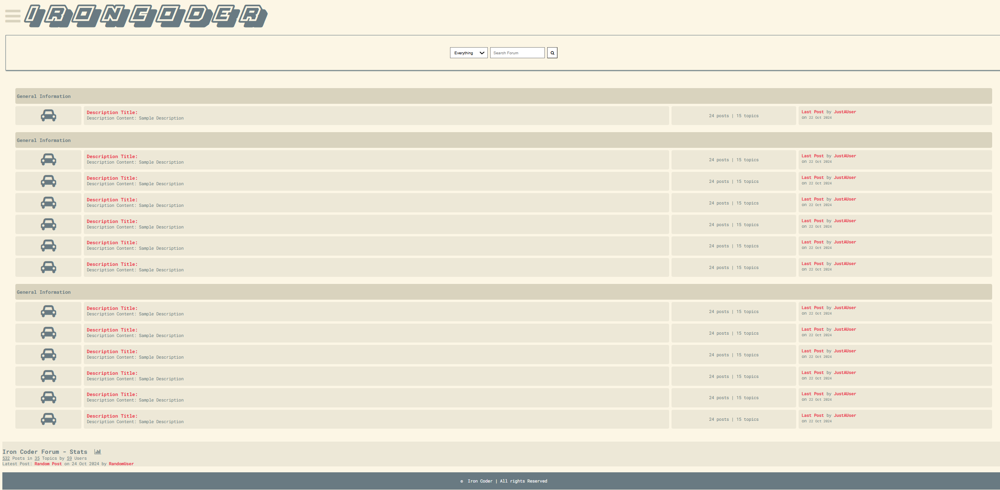
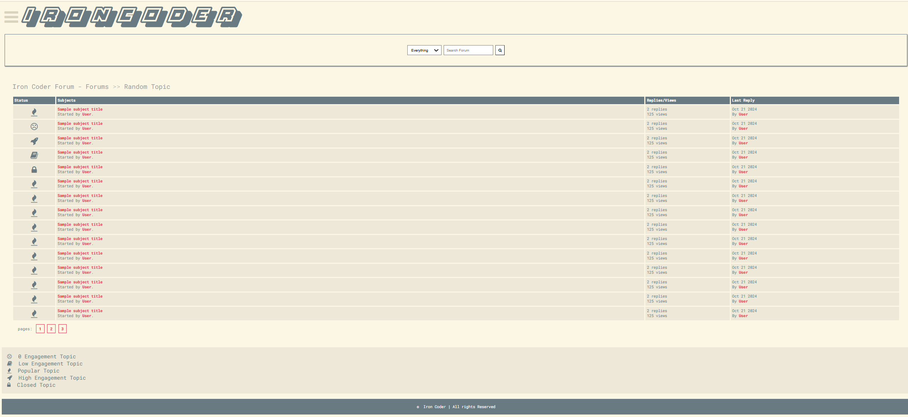
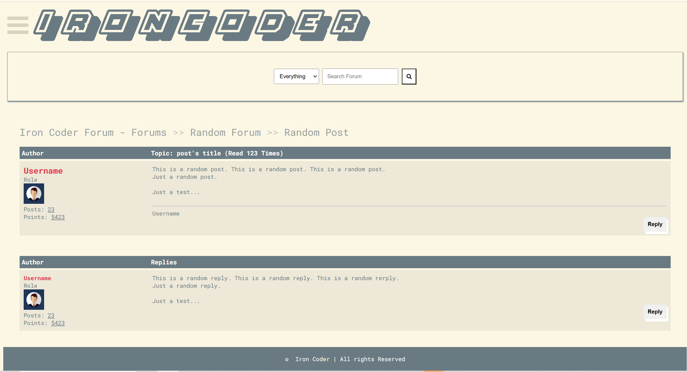

# How to Access the Forum
* Navigate to https://www.ironcoder.forum/ 

# Work Done for Beta Build
* Ability to search for posts by title, description, or by everything
	* Relevant posts are displayed with the Status, Subjects, Replies/Views, and Last Reply for each post
* Added engagement level status icons
	* Locked, sad face, fire, rocket, and book
	* Helps give an indication about the level of engagement 
* Added "No replies yet" message for posts that have 0 comments when browsing posts in the category page or in the Latest 10 Posts page. 
* Added ability for posts to be closed from the admin page.
	* When a post is closed, users are no longer able to reply to it
	* Users are presented with a "This Topic is Closed!" message and the comment/reply buttons are no longer visible
* Added message for users that are not logged in 
	* Message says "You need to login to comment or reply!"    
	* Comment/reply buttons are not visible
* Added TinyMCE rich text editor in the post creation page
	* Users can use different fonts, font sizes, headings, text colors, highlighted text, and more. 
	* Users have the ability to insert formatted code samples into their posts (Rust, Python, Javascript, C++)
		* Syntax highlighting when viewing the post page 
* Added ability for users to toggle the comment/reply input field when viewing a post
* Added URL icon (favicon) to the base template 
# Work Done for Alpha Build
* Ability to add comments/replies to posts through the UI
    * Only signed in users are able to post comments/replies
    * Once a user hits submit the page refreshes and the new comment/reply is displayed
    * The comments/replies appear in the admin page under the 'Comments' or 'Replies' section and under the post that the comment was made on
* Pagination
    * On the categories page, five posts are listed for each page. 
    * Users are able to navigate to the different pages by clicking on the numbered buttons.
* Site statistics section on the homepage
    * Displays the total number of posts, categories, users
    * Displays the latest post (users are able to navigate to it by clicking on the hyperlink)
    * Link to a page that displays the latest 10 posts
* Latest 10 Posts page
    * Displays the 10 most recent posts regardless of category. 
    * Users are able to navigate to the posts by clicking on them
# Known bugs
- Blank comments and replies get posted
- Posts that are not approoved show up in search results
- Status icons in the search results page don't get updated
- For latest post in the stats section and the 'Last post by ...' next to the categories, you are able to click on the links and view posts even if they haven't been approved yet.
- When creating an account without setting a profile picture, application will crash when trying to view the post in the UI
- No ability to edit comments/replies or delete them from the UI 
- If you are signed into a user account on the forum and then log into an admin account on the admin page, the user will be logged out and replaced by the admin on the forum
    - To prevent this, sign into the forum with a user account in an incognito tab
 - There are some styling inconsistencies that will need to be worked on as it relates to the color theme and arrangement of items on the page
 - There are some sizing issues when decreasing the size of the window. These would likely be visible on smaller devices like smartphones as well.  
 
# Iron-Coder-Forum Work Done in Design 1
* Frontend
    * Homepage, list of posts, and post pages are viewable and integrated with backend 
    * Login feature has been implemented
        * Only users that are logged in can post
    * Signup feature has been implemented
        * Users select username, password, display name, bio, and profile pic
    * Separate pages for login and signup
    * Implemented a Create Post page
        * Users can select a category
        * Gets reflected in the backend 
    * Displayed a search bar, copyright bar, navigation bar, reply to post button
* Backend
    * Admin can create posts, categories, replies, and comments for admin page
        * User registration implemented
        * All actions in the backend are visible in the app and vice versa
        * Posts need to be approved before being displayed
* Implemented basic styling based on the Solarized Light theme in Iron 
# Iron Coder Forum Architecture
- Frontend:
  - The frontend is built using HTML and styled using CSS 
  - Each page currently displays the logo at the top, the navigation bar, and the copyright bar
  - home.html
    - Displays topics/categories
  - posts.html
    - Contains list of posts for a particular category
  - details.html
    - Contains post, reply, and placeholder adding comment feature (will be implemented later)
- Backend:
  - The forum’s architecture is built with Django and utilizes its Model-View template framework to manage the frontend-backend interactions. The backend consists of models that represent authors, categories, posts, comments, and replies. The author model defines user functionality while models like categories/posts define the hierarchy of the discussion forums. Django’s admin page is used to manage all of the backend elements. For authentication, Django’s auth system was used. Posts, categories, comments, and replies are connected. A post belongs to a category and can have multiple comments. Comments can have multiple replies.
    
## Homepage

## Categories

## Post

